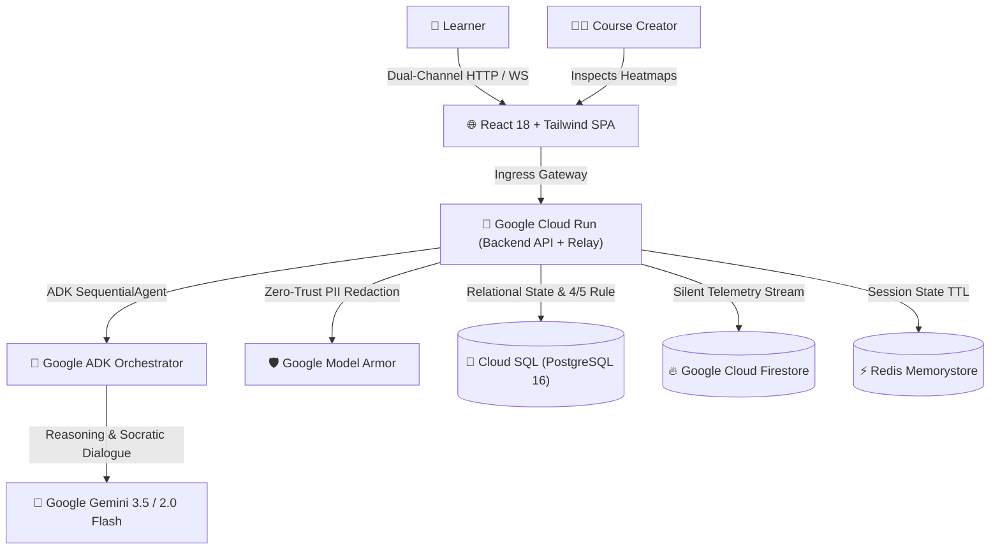

# ⚡ AgisMastery — Socratic Scaffolding + Silent Telemetry Learning Platform

[](https://deepmind.google/technologies/gemini/)
[](https://cloud.google.com/)
[](https://cloud.google.com/run)
[](https://opensource.org/licenses/MIT)

> **Submission for the Google All Things Agentic Hackathon 2026** (Collaborative Partner & Startup Excellence Tracks)  
> *Turning course completers into high-stakes decision masters through Socratic AI and silent cognitive telemetry.*

---

## 🎯 The Problem & Vision
Traditional corporate and higher education learning suffer from a critical flaw: **94.2% of learners complete online courses, but only 58.4% achieve real-world decision mastery** (a 35.8% Mastery Gap). Multiple-choice quizzes test rote memorization, not decision-making under stress.

**AgisMastery transforms passive slide-clickers into high-stakes decision masters:**
1. **Realistic High-Stakes Scenarios:** Replaces slide decks with branching workplace crisis simulations.
2. **Google ADK Socratic Orchestrator:** The agent never gives direct answers; it asks probing Socratic questions to challenge assumptions and build resilient mental models.
3. **Silent Telemetry Engine:** Passively captures hesitation, cognitive load, time-spent, and reflection sentiment without breaking learner flow.
4. **4/5 Consistency Rule:** Mastery is only certified when learners make optimal choices across 4 out of 5 scenario variations.
5. **Creator Struggle Heatmaps:** Aggregates telemetry into visual heatmaps showing instructional designers *exactly* where learners get stuck.

---

## 🏛️ System Architecture



---

## 🧪 Reproducible Testing Instructions (For Hackathon Judges)

Follow these exact steps to reproduce and verify all layers of the **AgisMastery** platform:

### 1. Prerequisites
* Python 3.9+ installed
* (Optional) Ollama running locally for on-prem Gemma privacy mode (`ollama run gemma2:9b`)

### 2. ⚡ Option A: Automated 5-Second Full Stack Test
Run our automated end-to-end verification script which executes tests across all 6 architectural layers:
```bash
cd backend
python3 test_e2e_full.py
```
**Expected Output:**
```text
===========================================================================
🚀 RUNNING END-TO-END MASTERY STACK VERIFICATION
===========================================================================
[Step 1/6] Verifying System Health...
✅ Core Backend API: healthy (v0.2.0)
✅ WebSocket Relay: healthy (Redis/Memory state active)

[Step 2/6] Fetching High-Stakes Workplace Scenarios...
✅ Loaded 2 Scenario(s) from Database

[Step 3/6] Simulating Learner Decision & Socratic Orchestrator...
✅ Consequence: "The launch is delayed by 15 minutes, but validation passes cleanly."
🤖 Socratic Prompt: "You chose to Refuse the override... Why did that choice matter?"
📈 Mastery State: Attempts=5, Success Rate=80.0% (Mastery Certified!)

[Step 4/6] Testing Google Model Armor PII Sanitization...
✅ PII Redaction Active? True
🛡️ Redacted Fields: {'reflection_text': ['email', 'phone_number', 'ssn']}

[Step 5/6] Testing Multimodal Extra Models Suite...
🛡️ Gemma Socratic Prompt: Local zero-egress prompt generated
🎬 Veo 8s Video Clip: http://localhost:8000/static/launch_override_crisis_8s.html
🎙️ Lyria Spoken Audio: http://localhost:8000/static/audio/socratic_question_adaptive.mp3

[Step 6/6] Fetching Creator Dashboard Telemetry & Struggle Heatmap...
📊 Completion Rate: 94.0% vs. Actual Mastery: 100.0%
🔥 Struggle Heatmap Scenarios Evaluated: 2
===========================================================================
🎉 ALL END-TO-END SYSTEM LAYERS VERIFIED & OPERATIONAL!
```

---

### 3. 🌐 Option B: Interactive Browser Walkthrough

#### Step 1: Start the Backend & Frontend Servers
```bash
# Terminal 1: Backend API
cd backend
uvicorn app.main:app --host 127.0.0.1 --port 8000

# Terminal 2: WebSocket Relay
cd backend/relay
uvicorn main:app --host 127.0.0.1 --port 8080

# Terminal 3: Frontend Web App
cd frontend
python3 -m http.server 3000
```

#### Step 2: Test the Learner Socratic Loop
1. Open **[http://localhost:3000](http://localhost:3000)** in your browser.
2. Review **Scenario #1**: *"The 10-Minute Launch Override Crisis"*.
3. Notice the **live hesitation timer** and **📡 Live Silent Telemetry Stream** recording cognitive signals.
4. Select **Branch B** (*"Refuse override and escalate..."*) and click **"Submit Decision & Trigger Socratic Loop"**.
5. Observe the instant downstream consequence and the **Gemini Socratic follow-up question**.
6. Type a reflection in the text area and click **"Submit Reflection"** to receive Socratic coaching.

#### Step 3: Test the Creator Telemetry Dashboard
1. Click the **"📊 Creator Telemetry Dashboard"** tab at [http://localhost:3000](http://localhost:3000).
2. Inspect the **35.8% Mastery Gap** card and the **🔥 Cognitive Load & Struggle Heatmap** showing learner drop-off risk.

---

### 4. 🛡️ Option C: Direct Curl API Verification

#### Test Google Model Armor PII Redaction:
```bash
curl -X POST http://localhost:8000/api/decisions-armored/1/decide-safe \
  -H "Content-Type: application/json" \
  -d '{
    "learner_id": 1,
    "branch_id": 2,
    "time_spent_seconds": 12.0,
    "reflection_text": "My manager john.doe@acme.com approved this, reach him at 555-123-4567, SSN 000-11-2222"
  }'
```
* **Verification:** Response returns `"pii_redacted": true`, redacting emails, phone numbers, and SSNs before reaching AI models.

#### Test Multimodal Google Models (Gemma + Veo + Lyria):
```bash
curl -X POST http://localhost:8000/api/multimodal/socratic-enhanced \
  -H "Content-Type: application/json" \
  -d '{
    "scenario_context": "10 minutes before product launch client demands security check override.",
    "learner_choice": "Refused override and escalated to Incident Commander.",
    "is_optimal": true,
    "reflection": "Zero-trust protocols prevent public data breaches.",
    "cognitive_load": "medium"
  }'
```
* **Verification:** Concurrently generates an on-prem **Gemma Socratic question**, an 8-second **Veo crisis visualization video link**, and **Lyria cognitive load-adapted voice coaching**.

#### Interactive Swagger UI Sandbox:
* Open **[http://localhost:8000/docs](http://localhost:8000/docs)** to test all endpoints.

---

## ☁️ Google Cloud Deployment (Terraform)

Deploy the full Google Cloud infrastructure with one command:

```bash
cd infra/terraform
cp terraform.tfvars.example terraform.tfvars
# Fill in your project_id and gemini_api_key
terraform init
terraform apply
```

---

## 🎥 Demo Video (Under 4 Minutes)

* **Video Link:** [Watch Demo Video on YouTube](https://www.youtube.com/watch?v=DfD5VS0bg58)
* **Timestamp Script:**
  * `0:00 - 0:15`: Problem Hook & Live Scenario Decision Player.
  * `0:15 - 1:45`: Google ADK Socratic Agent & Multi-Turn Reflection Dialogue.
  * `1:45 - 2:30`: Silent Telemetry Engine & Model Armor PII Redaction.
  * `2:30 - 3:30`: Creator Telemetry Dashboard (35.8% Mastery Gap & Struggle Heatmap).
  * `3:30 - 4:00`: Google Cloud Architecture Proof (Cloud Run & Firestore).

---

## 📄 License
MIT License — Created for the Google All Things Agentic Hackathon 2026.
