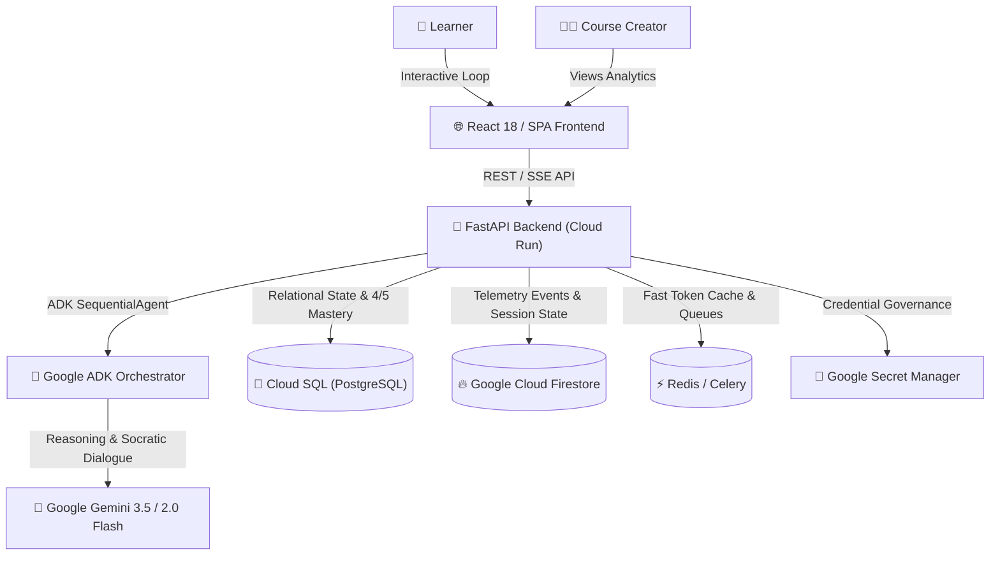

# ⚡ Mastery — Socratic Scaffolding + Telemetry Learning Platform

> Built for the **Google All Things Agentic Hackathon** (Collaborative Partner Track)  
> Powered by **Gemini 3.5**, **Google ADK (Agent Development Kit)**, and **Google Cloud Run**.

---

## 🎯 The Problem & Vision
Traditional corporate and higher education learning suffer from a critical flaw: **94% of learners complete courses, but only 58% achieve real-world decision mastery** (a 35.8% Mastery Gap). 

**Mastery transforms passive slide-clickers into high-stakes decision makers:**
1. **Realistic High-Stakes Scenarios:** Replaces slides with branching crisis simulations.
2. **Google ADK Socratic Agent:** Instead of giving answers, the agent engages in a multi-turn Socratic dialogue to explore underlying mental models and trade-offs.
3. **Silent Telemetry Engine:** Passively captures hesitation, cognitive load, time-spent, and reflection sentiment.
4. **Creator Redesign Dashboard:** Aggregates telemetry into friction heatmaps so L&D teams know *exactly* where learners struggle and how to redesign scenarios.

---

## 🏛️ System Architecture



*For detailed component-level sequence diagrams, see [`docs/architecture.md`](docs/architecture.md).*

---

## 🛠️ Technology Stack & Compliance
* **AI Model:** Google Gemini 3.5 & `gemini-2.0-flash` via Google Gemini API / Vertex AI.
* **Agent Framework:** **Google Agent Development Kit (`google-adk`)** featuring `SequentialAgent` and specialized `LlmAgent` sub-agents.
* **Backend:** FastAPI, Python 3.11+, SQLAlchemy, Pydantic v2.
* **Storage & Telemetry:** Google Cloud Firestore (sessions/telemetry events), Google Cloud SQL (PostgreSQL 15), SQLite (local zero-dependency development).
* **Cloud Infrastructure & IaC:** Google Cloud Run, Google Secret Manager, Terraform (`infra/terraform/`).

---

## 🚀 Quick Start (Local Development)

### 1. Backend Setup & Test
```bash
cd backend
python3 -m venv .venv
source .venv/bin/activate
pip install -r requirements.txt
cp .env.example .env

# Run standalone Socratic pipeline test:
python3 test_agent.py

# Start local FastAPI server:
uvicorn app.main:app --reload --host 0.0.0.0 --port 8000
```
* Interactive API Documentation: `http://localhost:8000/docs`
* Health Check: `http://localhost:8000/health`

### 2. Frontend Launch
Open `frontend/index.html` in any browser, or serve it locally:
```bash
cd ../frontend
python3 -m http.server 3000
```

---

## ☁️ Google Cloud Deployment (Terraform)

Deploy the entire infrastructure (Cloud Run, Cloud SQL, Firestore, Secret Manager) in a single command:

```bash
cd infra/terraform
terraform init
terraform apply -var="project_id=YOUR_GCP_PROJECT_ID" -var="gemini_api_key=YOUR_API_KEY"
```

---

## 🎥 Demo Video (Under 4 Minutes)

* **Video Link:** `https://youtu.be/YOUR_DEMO_VIDEO_ID` *(Placeholder - Upload to YouTube/Vimeo)*
* **Video Timestamp Breakdown:**
  * `0:00 - 0:15`: Instant hook showing the live scenario decision player.
  * `0:15 - 1:45`: Learner makes a decision and receives Gemini Socratic feedback + reflection prompt.
  * `1:45 - 2:45`: Silent Telemetry stream recording hesitation and updating the 4/5 Mastery Progress bar.
  * `2:45 - 3:30`: Creator Telemetry Dashboard showing the 35.8% Mastery Gap and Cognitive Load Heatmap.
  * `3:30 - 4:00`: Proof of deployment in Google Cloud Console (Cloud Run + Firestore logs).

---

## 📄 License
MIT License — Created for the Google All Things Agentic Hackathon 2026.
