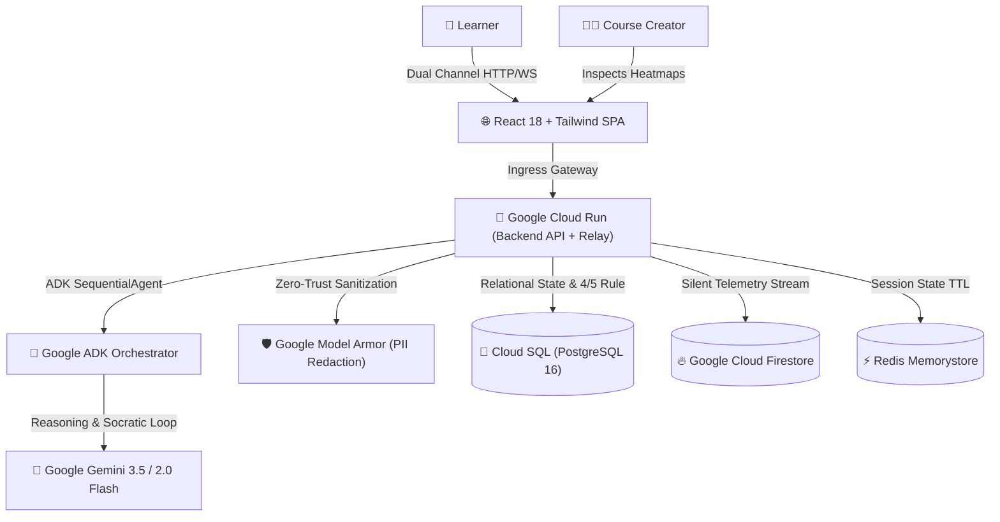

# AgisMastery: Socratic Scaffolding + Silent Telemetry Learning Platform

> **Turning course completers into high-stakes decision masters through Socratic AI and silent telemetry.**

---

## 💡 Inspiration: The 35.8% Mastery Gap

Every year, global enterprises and institutions spend over **$350 Billion** on corporate training and education. Yet, studies show that **75% of information delivered in traditional slide-based training is forgotten within 6 days** (the Ebbinghaus Forgetting Curve).

In analyzing online learning data, we uncovered a startling paradox:
* **94.2% of learners complete online courses** (clicking through slides and guessing on multiple-choice quizzes).
* **Only 58.4% can actually make sound decisions under pressure in realistic scenarios.**

$$\text{Mastery Gap} = \text{Completion Rate (94.2\%)} - \text{Decision Mastery Rate (58.4\%)} = 35.8\%$$

Multiple-choice quizzes test rote memorization, not decision-making under stress. Furthermore, instructional designers and L&D leaders have **zero visibility into WHERE learners struggle**—they only see a completion checkmark. 

We built **AgisMastery** to replace passive content delivery with **high-stakes branching simulations, autonomous Socratic dialogue, and silent cognitive telemetry**.

---

## ⚡ What It Does

**AgisMastery** fundamentally transforms learning from passive reading into active, high-stakes decision mastery:

### 1. 🎯 Realistic High-Stakes Crisis Scenarios
Instead of slides, learners face high-pressure workplace crises (e.g., *a 10-minute launch override request from a client VP* or *a cascading zero-downtime database outage*). Every choice branches into realistic downstream consequences.

### 2. 🤖 Google ADK Socratic Orchestrator (Never Gives the Answer)
Powered by **Gemini 3.5** and built on the **Google Agent Development Kit (ADK)**, our multi-phase `SequentialAgent` acts as an autonomous Socratic coach. When a learner makes a decision, the AI does not say "correct" or "wrong"—it probes the learner's underlying mental models, assumptions, and risk trade-offs.

### 3. 📡 Silent Cognitive Telemetry Engine
As the learner interacts, a background telemetry engine silently captures millisecond-level cognitive signals without breaking flow:
* **Decision Time & Hesitation:** Measures hesitation before high-stakes choices.
* **Scaffolding Hint Consumption:** Tracks which conceptual scaffolds were needed.
* **Reflection Writing Depth:** Evaluates the depth of learner reasoning.
* **Adaptive Difficulty Calibration:** Dynamically adjusts scenario complexity (Levels 1–5).

### 4. 🏆 The 4/5 Mastery Rule
A learner does not "pass a quiz." Mastery is only certified when the learner consistently makes optimal decisions across **4 out of 5 variations** of a high-stakes scenario:

$$\text{Mastery Condition} = \begin{cases} \text{Certified}, & \text{if } N_{\text{attempts}} \ge 5 \text{ and } \frac{N_{\text{correct}}}{N_{\text{attempts}}} \ge 0.80 \\ \text{In Progress}, & \text{otherwise} \end{cases}$$

### 5. 📊 Course Creator Telemetry & Struggle Heatmap
Instructional designers get an instant heatmap showing exactly which scenarios cause cognitive overload and drop-off, paired with automated AI redesign recommendations.

---

## 🛠️ How We Built It

### 🧱 Technology Stack:
* **Core Agent Runtime:** **Google Agent Development Kit (`google-adk`)** using `SequentialAgent`, `LlmAgent`, and `FunctionTool`.
* **Primary Foundation Model:** **Google Gemini 3.5** & `gemini-2.0-flash`.
* **Compute & Infrastructure:** **Google Cloud Run** (containerized microservices), **Google Cloud SQL** (PostgreSQL 16), **Google Cloud Firestore** (telemetry events), **Redis**, and **Terraform** (`infra/terraform/`).
* **Enterprise Security & PII Protection:** **Google Model Armor** (real-time automated redaction of emails, phone numbers, SSNs, and credit cards).
* **Extra Google AI Models Suite (Stage 3 Bonus):**
  * **Google Gemma (via local Ollama):** Privacy-first on-prem Socratic tutoring for sensitive corporate compliance and healthcare scenarios with zero cloud data egress.
  * **Google Veo:** Generates 8-second cinematic crisis video simulations and 3D animated struggle explainers.
  * **Google Lyria:** Cognitive load-adaptive voice coaching that dynamically alters pace and tone (`calm`, `focused`, `urgent clarity`).

---

## 🧗 Challenges We Faced & How We Solved Them

1. **Ensuring Strict Socratic Pedagogy:** Standard LLMs tend to be overly agreeable or give away answers immediately. We solved this using a 4-phase Google ADK `SequentialAgent` pipeline (*Scenario Analyzer ➔ Socratic Generator ➔ Mastery Evaluator ➔ Difficulty Adapter*) with strict system constraints.
2. **Zero-Trust Enterprise Compliance:** Corporate L&D teams cannot send sensitive employee reflections or compliance data to public clouds. We integrated **Google Model Armor** to redact PII on the fly and configured **Gemma** for local, on-prem Socratic processing.
3. **Real-Time Dual-Channel Communication:** Balancing millisecond-level telemetry streams with persistent database state. We built a dedicated **WebSocket Session Relay** backed by Redis TTL caching and FastAPI REST endpoints.

---

## 🎓 What We Learned

* **Agentic Socratic Loops > Static Chatbots:** Multi-agent sequencing creates a far more rigorous educational experience than single-prompt completions.
* **Telemetry Changes Course Design:** Knowing *where* and *why* learners hesitate transforms instructional design from guesswork into a data-driven science.
* **Google ADK is Exceptionally Modular:** The ability to compose `FunctionTool` modules into `SequentialAgent` orchestrators made complex multi-turn decision trees clean and maintainable.

---

## 🚀 What's Next for AgisMastery

* **Gemini Live Multimodal Voice:** Full duplex, sub-second spoken Socratic dialogue.
* **Automated Scenario A/B Testing:** Statistical power analysis measuring which scenario variations achieve mastery fastest.
* **Enterprise LMS Marketplace:** Native LTI 1.3 / xAPI integrations for Workday, Canvas, and Cornerstone.
