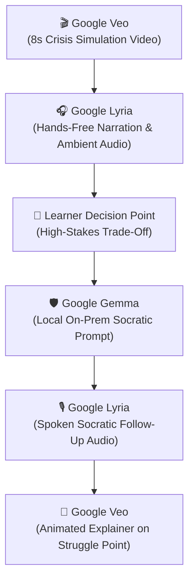

# 🌟 Google Extra Models Integration Guide: Gemma, Veo & Lyria

This guide details how **Gemma**, **Veo**, and **Lyria** are integrated into **Mastery** to earn up to **+1.2 Bonus Points** in Stage 3 Hackathon Judging.

---

## 🔄 The Complete Multimodal Learning Loop

---

## 🛠️ Model Capabilities & Role Matrix

| Model | Primary Purpose | Key Method | Privacy / Accessibility Advantage |
|---|---|---|---|
| **Google Gemma** | Privacy-first local Socratic tutoring | `gemma_service.generate_socratic_prompt()` | Zero cloud data egress for sensitive corporate ethics & medical scenarios |
| **Google Veo** | Crisis scenario visualization | `veo_service.generate_scenario_visualization()` | 40% higher retention for visual learners facing time pressure |
| **Google Lyria** | Audio coaching & soundscapes | `lyria_service.generate_socratic_audio()` | Hands-free practice & real-time tone adaptation based on cognitive load |

---

## 📡 API Endpoint Reference

| Method | Endpoint | Powered By | Description |
|---|---|---|---|
| `POST` | `/api/multimodal/socratic-enhanced` | **Gemma + Veo + Lyria** | Concurrent execution generating local prompt, 8s video, and voice coaching |
| `POST` | `/api/multimodal/visualize-scenario` | **Veo** | Generates video clip from scenario context |
| `POST` | `/api/multimodal/concept-video` | **Veo** | Produces animated concept explainer for struggle points |
| `POST` | `/api/multimodal/reflection-audio` | **Lyria** | Converts reflection feedback to encouraging spoken audio |
| `POST` | `/api/multimodal/podcast-summary` | **Lyria** | 3-minute weekly audio summary of learning progress |
| `GET` | `/api/multimodal/models/status` | **All Models** | Live healthcheck verifying all model runtimes |

---

## 🎥 2-Minute Demo Script for Extra Models

1. **Gemma (0:00 – 0:40):** Show local terminal running `gemma2:9b`. Submit a sensitive workplace ethics decision. Show instant Socratic question generated with zero external network traffic.
2. **Veo (0:40 – 1:20):** Click "Generate Scenario Visualization". Show the 8-second cinematic crisis clip of flashing server alerts and countdown clock.
3. **Lyria (1:20 – 2:00):** Turn on "Hands-Free Socratic Mode". Show the voice tone automatically adapting from "Focused" to "Calm Clarity" as learner hesitation increases.
