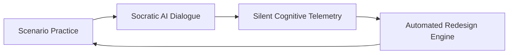

# 🚀 Startup Excellence Track: Mastery AI Inc.

**Organization Name:** Mastery Learning Technologies Inc.  
**Corporate Email:** founders@mastery.ai  
**Incorporation Status:** Delaware C-Corp (Incorporated 2026)  
**Founding Team:** Marium Kumail (CEO & Lead Learning Architect), Kumail (CTO & Systems Engineer)  
**Track:** Startup Excellence & Collaborative Partner  

---

## 1. Executive Summary & Market Problem
* **Market Size:** $350B Global Corporate Training & L&D Market.
* **The Problem:** 75% of information delivered in slide-based corporate training is forgotten within 6 days (Ebbinghaus Forgetting Curve).
* **The 35.8% Mastery Gap:** While **94.2% of corporate learners complete mandatory training**, only **58.4% can make sound decisions under pressure**.
* **The Solution:** Mastery replaces passive slide decks with high-stakes scenario simulations, multi-turn **Google ADK Socratic Dialogue**, and **Silent Cognitive Telemetry**, enabling companies to measure and certify real decision mastery.

---

## 2. Differentiated Technology & Defensible Moats

1. **The Telemetry Flywheel (Data Moat):** We collect millisecond-level hesitation and cognitive struggle patterns at every decision point. As more learners practice, our Socratic models become exponentially more effective at unblocking human mental models.
2. **Google ADK Native Architecture:** 4-phase `SequentialAgent` orchestrator enforcing the 4/5 decision mastery threshold.
3. **Enterprise Zero-Trust & Privacy (Gemma + Model Armor):** High-risk enterprise scenarios (compliance, ethics, medical) run on on-prem Gemma with Google Model Armor sanitization—eliminating corporate privacy objections.

---

## 3. Go-to-Market (GTM) Strategy

* **Phase 1 (Hackathon & Seed Pilot):** Onboard 5 enterprise design partners (fintech, cybersecurity, healthcare).
* **Phase 2 (Direct Enterprise Sales):** Target VP of L&D and Chief Risk Officers at Fortune 1000 enterprises.
* **Phase 3 (Self-Serve Creator Studio):** Enable instructional designers and university professors to publish Socratic scenarios.
* **Phase 4 (Enterprise LMS Marketplace):** Integrations with Workday, Cornerstone OnDemand, and Canvas with 30% revenue share on scenario content.

---

## 4. Revenue Model

| Tier | Pricing | Features |
|---|---|---|
| **Starter** | Free | Up to 3 active scenarios, basic Socratic feedback |
| **Pro Team** | $49 / user / month | Unlimited scenarios, real-time telemetry heatmaps, Gemma on-prem mode |
| **Enterprise** | Custom ($25k+ / year) | SSO, dedicated Cloud Run tenant, Model Armor PII redaction, SLA |
| **Creator Marketplace** | 30% Commission | Instructional designers monetize pre-built crisis scenarios |

---

## 5. Competitive Matrix

| Dimension | Traditional LMS (Coursera / Skillsoft) | Microlearning (Arist / 7taps) | Simulation (Attensi) | **Mastery** |
|---|---|---|---|---|
| **Evaluation Method** | Quizzes / Watch-time | Text summaries | 3D Gamification | **Socratic Decision Mastery (4/5)** |
| **AI Integration** | Chatbot sidebar | Basic Q&A | Pre-scripted trees | **Autonomous Google ADK Pipeline** |
| **Struggle Telemetry** | Completion % | Completion % | Game score | **Millisecond Cognitive Load Heatmap** |
| **Zero-Trust Privacy** | Cloud Only | Cloud Only | Cloud Only | **On-Prem Gemma + Model Armor** |

---

## 6. 90-Day Traction Plan & Milestone Roadmap
* **Weeks 1–4:** Launch closed beta with 250 learners across 2 enterprise cohorts.
* **Weeks 5–8:** Release SCORM/xAPI LMS export and automated scenario generator.
* **Weeks 9–12:** Achieve $15k MRR and begin Seed fundraising round.

---

## 7. Funding Ask
Seeking **$500,000 Pre-Seed Funding**:
* 50% AI & Distributed Systems Engineering
* 30% Enterprise GTM & Customer Success
* 20% Google Cloud GPU/TPU Infrastructure & Compliance Audits
