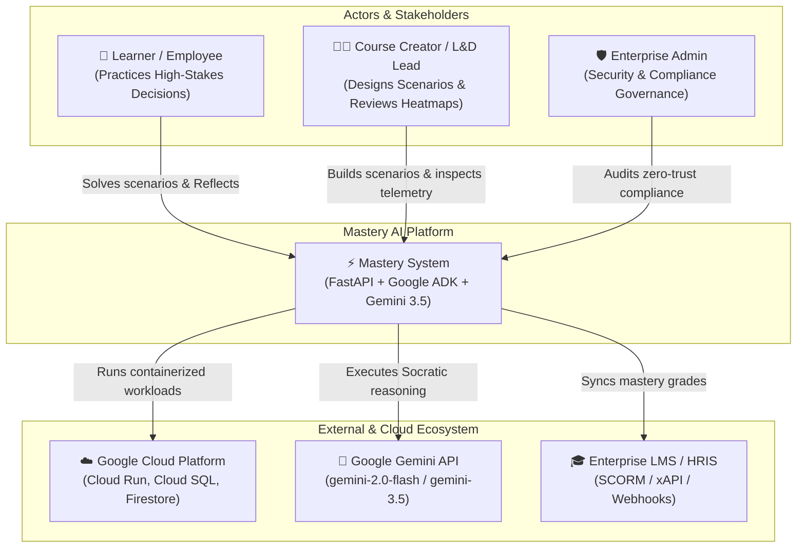
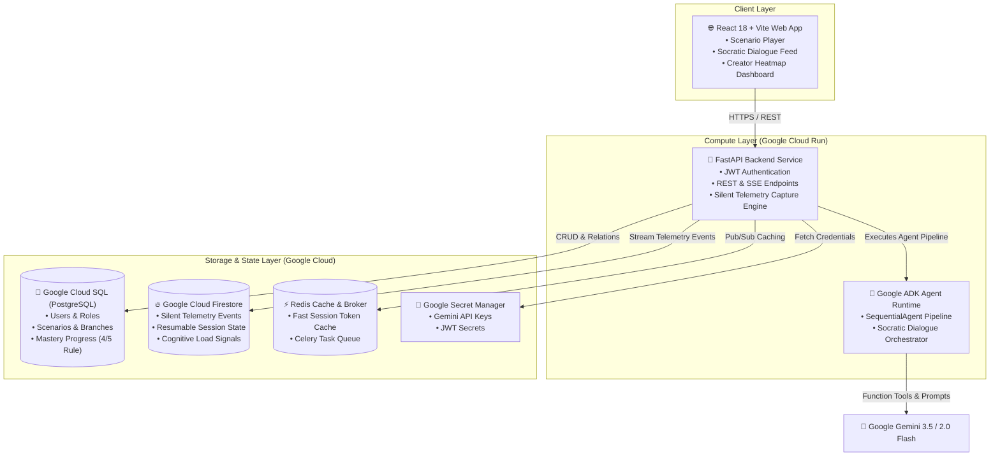
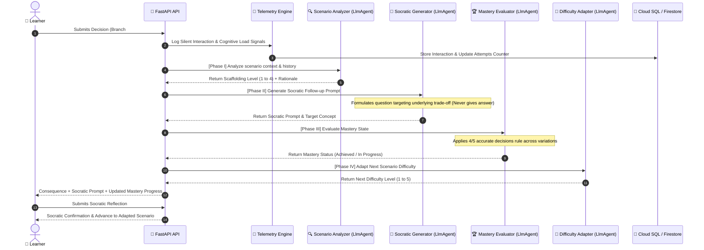
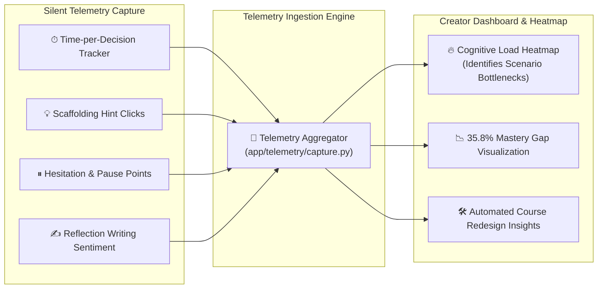

# 🏛️ Mastery Architecture & Technical Specifications

Mastery is an autonomous agentic learning platform built with **Gemini 3.5**, **Google ADK (Agent Development Kit)**, and **Google Cloud Platform**. It is specifically designed to eliminate the 35.8% gap between course completion and real-world decision mastery.

---

## 1. System Context Diagram (Level 1)

---

## 2. Container Diagram (Level 2)

---

## 3. Google ADK Socratic Agent Flow Diagram (Level 3)

The **Socratic Orchestrator** is implemented as a `google.adk.agents.SequentialAgent` executing 4 coordinated phases:

---

## 4. Silent Telemetry & Redesign Dataflow

