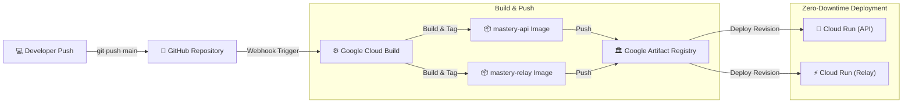

# 🚀 Mastery Cloud Build CI/CD Pipeline

This directory contains automated continuous deployment configurations for deploying Mastery to **Google Cloud Run**.

---

## 🏗️ Architecture Flow

---

## 📂 Directory Contents
* **`cloudbuild.yaml`**: Full 5-step build, push, and deployment pipeline for multi-service Cloud Run.
* **`triggers.md`**: Step-by-step instructions to enable APIs, create Artifact Registry, and link GitHub triggers.
